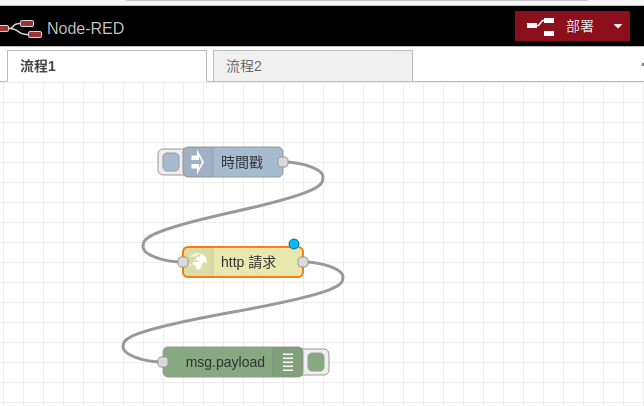

# Node-Red

## 組員

B1042109 楊語涵

B1042101 黃宇萱

<!-- vim-markdown-toc GFM -->

* [Node-Red 介紹](#node-red介紹)
* [安裝Node-Red](#安裝node-red)
* [Node-Red操作說明](#node-red操作說明)
* [參考資料](#參考資料)

<!-- vim-markdown-toc -->

## Node-Red介紹
Node-RED 是 IBM 以 Node.js 為基礎，開發出來的視覺化 IOT 開發工具，因為純粹透過流程圖的方式工作，所以不需要會 Node.js 也可以透過 Node-RED 完成許多後端才能做的事情。
```shell
Node-Red官方網站: https://nodered.org/
```

## 安裝Node-Red

- 更新系統
```shell
sudo apt update
sudo apt upgrade -y
```
- 安裝Node.js
```shell
sudo apt install nodejs libnode64
```
- 確認Node.js版本
```shell
node -v
```

- 安裝npm
```shell
sudo apt install npm
```
- 確認npm版本
```shell
npm -v
```

- 安裝Node-Red 
```shell
sudo npm install -g --unsafe-perm node-red node-red-admin
sudo ufw allow 1880
```
- 打開Node-Red
```shell
node-red
```
- 與Node-Red連結

到ubuntu裡的瀏覽器貼上網址。注意，終端機的最後一個指令需停留在node red(顯示網址)


## Node-Red操作說明

- 編輯inject節點


- 編輯http request節點


- 將結點連起來


- 點擊部署




- 查看除錯窗口


## 參考資料
https://tutorials.webduino.io/zh-tw/docs/socket/useful/node-red.html
https://www.youtube.com/watch?v=_FxcQSjr0Tc
https://www.youtube.com/watch?v=LmC9ipfBGd4
